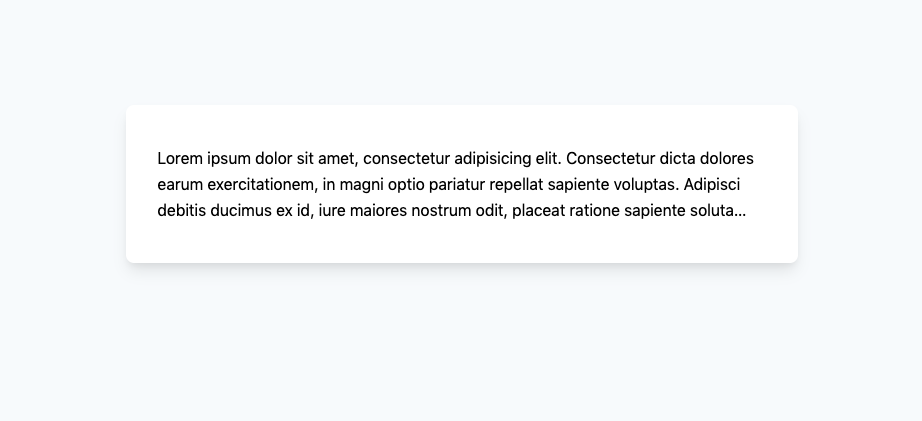

## Tailwindcss Plugin: Multiple Line

[](https://github.com/wahlemedia/tailwindcss-plugin-multiple-lines/actions)

This plugin adds helpers for the css `line-clamp` property that truncates text 
at a specific number of lines within TailwindCSS.


The plugin was inspired by the [CSS-Ticks](https://css-tricks.com/almanac/properties/l/line-clamp/)
Article. 


## Installation 
Add this plugin to your project
```
  npm install tailwindcss-plugin-multiple-lines --save-dev
```

## Usage
This plugin generate styles for the `line-clamp` CSS Property

This plugin accepts following options:
* `lineClamp` The Number of lines that should be generated. The default are `[1,...,10]`

Here is an example how to add this plugin to your project

```
// tailwind.config.js
const multipleLinesPlugin = require('tailwindcss-plugin-multiple-lines');

module.exports = {
  theme: {
    extend: {}
  },
  variants: {},
  plugins: [
    multipleLinesPlugin()
  ]
};
```
The default configuration would create the following classes:
The classes `.clamp-0` through `.clamp-9` are also generated with the responsive prefix.
```
.clamp-0 {
    -webkit-line-clamp: unset
}
       
.clamp-1 {
  -webkit-line-clamp: 1
}

.clamp-2 {
  -webkit-line-clamp: 2
}

.clamp-3 {
  -webkit-line-clamp: 3
}

.clamp-4 {
  -webkit-line-clamp: 4
}

.clamp-5 {
  -webkit-line-clamp: 5
}

.clamp-6 {
  -webkit-line-clamp: 6
}

.clamp-7 {
  -webkit-line-clamp: 7
}

.clamp-8 {
  -webkit-line-clamp: 8
}

.clamp-9 {
  -webkit-line-clamp: 9
}

.box {
  display: -webkit-box;
}

.orient-vertical {
  -webkit-box-orient: vertical
}

.orient-horizontal {
  -webkit-box-orient: horizontal
}

.orient-axis-block {
  -webkit-box-orient: block-axis
}

.orient-inline-block {
  -webkit-box-orient: block-inline
}

.orient-unset {
  -webkit-box-orient: unset
}
``` 

## Example


```
<div class="mx-auto md:max-w-2xl flex bg-white rounded-lg shadow-lg overflow-hidden mt-32 px-8 py-10">
    <p class="box clamp-5 sm:clamp-4 md:clamp-3 orient-vertical overflow-hidden leading-relaxed">
       Lorem ipsum dolor sit amet, consectetur adipisicing elit. 
       Consectetur dicta dolores earum exercitationem, in magni optio pariatur 
       repellat sapiente voluptas. Adipisci debitis ducimus ex id, iure maiores 
       nostrum odit, placeat ratione sapiente soluta temporibus voluptatem voluptatibus. 
       Aperiam aut explicabo, iure numquam porro quam quod quos ratione saepe sed?
    </p>
</div>
```
## Testing
To run the tests
```
npm run test
```


## Licence
[MIT](./LICENCE.md)
